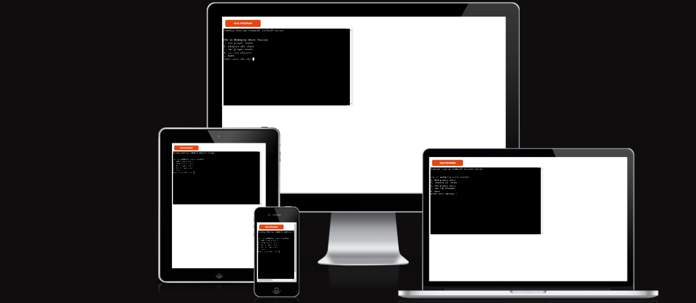
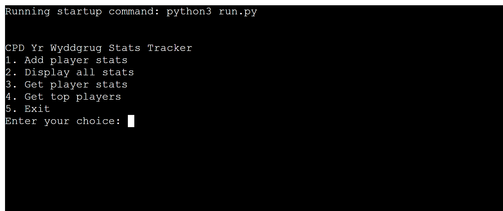
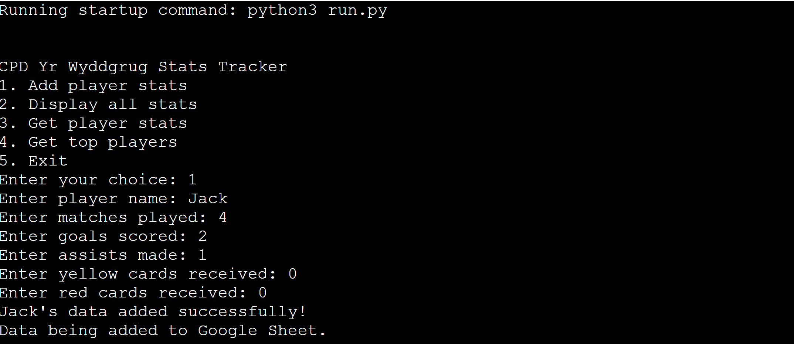
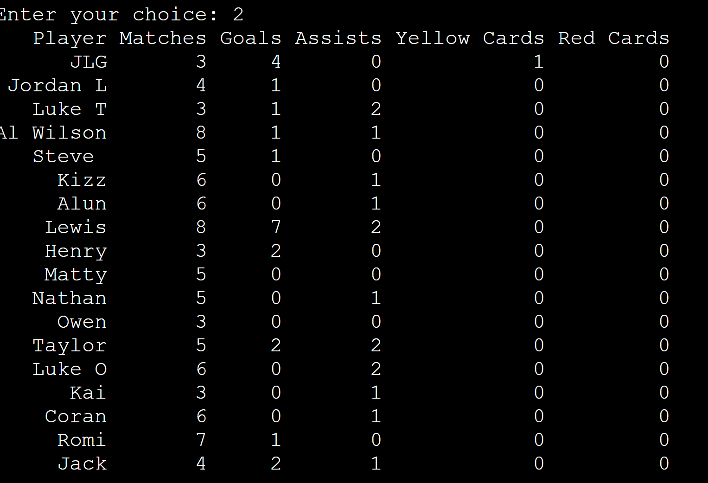
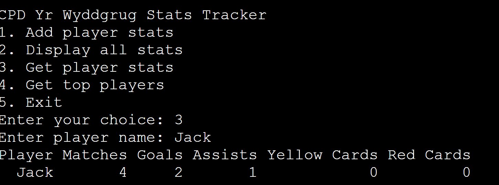
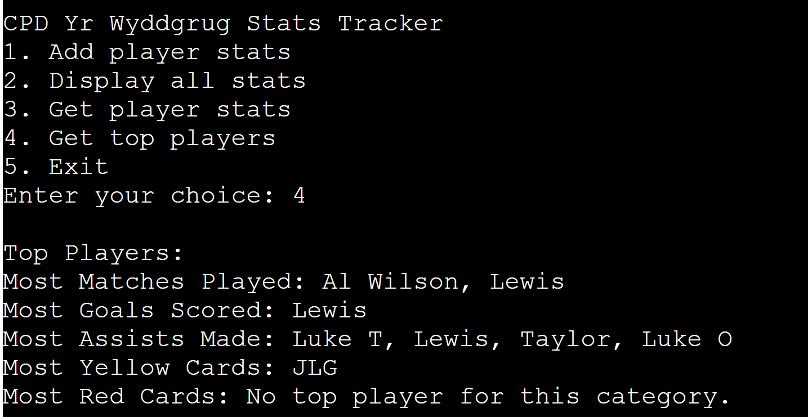
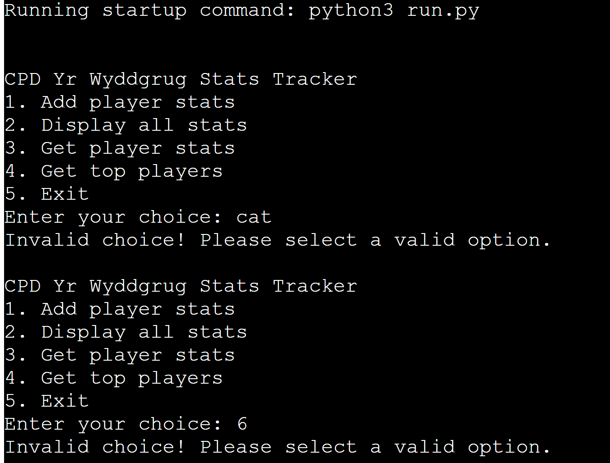
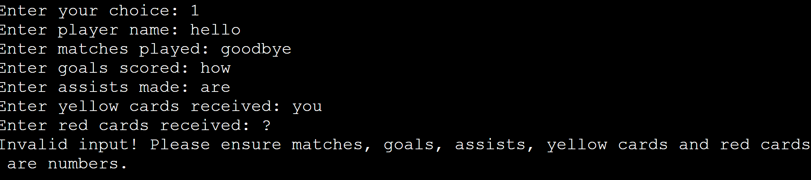
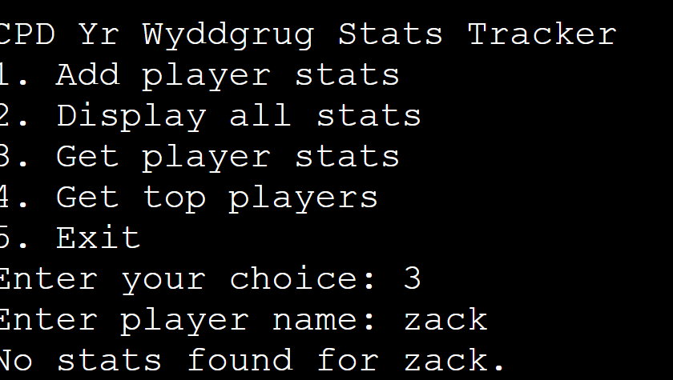
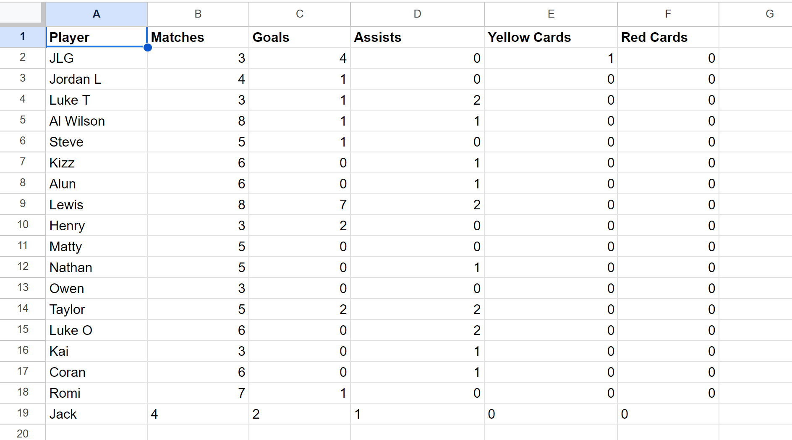

# CPD Yr Wyddgrug Football Player Statistics Tracker

## Introduction

This project is a **Football Player Statistics Tracker** for my local football club CPD Yr Wyddgrug for the 24/25 campaign. 
The application allows the user to store, retrieve, and manage football player statistics such as matches played, goals scored, assists, and disciplinary records (yellow and red cards). The stats are saved to and retrieved from a Google Sheet, ensuring the data is accessible and persistent.

The application provides a command-line interface for:
- Adding player stats.
- Retrieving a list of all players' stats.
- Viewing stats for a specific player.
- Identifying top players based on various performance metrics such as goals, assists, and cards.

The data is stored in a Google Sheet to ensure easy sharing and backup. The project uses Python libraries such as Pandas for data manipulation and Gspread for Google Sheets integration.

Here is the live version of my project which was deployed on **Heroku**: https://cpd-player-stats-748f3c894933.herokuapp.com/

---

## How to Use It

The Statistics Tracker allows the user to view or input current statisitcs for the players of CPD Yr Wyddgrug. The user will be met with a simple menu;

If the user chooses to **1. Add player stats** they will be greeted with a series of questions where they are able to input a players stats.

This data is added to the Google Sheet and can also be displayed when picking option **2. Display all stats** (it will be added to the bottom).

A specific players stats can also be retrieved when choosing option **3. Get players stats**.
You enter the name of the player you want to see, and their stats will be displayed.

The user is able to see who the top performer in each specific is by choosing option **4. Get top players** 

Finally, the users have the option to **5. Exit** should they wish, which would terminate the programme. Otherwise, the programme will just keep prompting them to select an option. 

# Features

## Existing Features
The user is greeted with a simple menu that has been mentioned in the ***How to Use It*** section, within this section a lot of the *Existing Features* have been mentioned, including;
- Updating of data / Google Sheet 
- Retrieval of all data
- Retrieval of a specific players data
- The retrieval of the top performer in each category

Additional features within the programme; 
- Input validation and error-checking:
    - You cannot enter an option on the start menu that is not a **1, 2, 3, 4 or 5.**
    - When adding player stats you can only enter numbers after the *player name* option.
    
    
    - If a players name doesn't exist then an error message is displayed.
    
    - When retrieving a players name it is not case sensitive.
    - If there are multiple top performers then their names are all displayed. 
    - If there is no top performer then that message is relayed.

## Future Features 
- The addition of first and surnames to allow easy differentiation between players. 
- The inclusion of more statistics, including;
    - Minutes played 
    - Man of the matches achieved
    - Substitute appearances 
- To allow for live update of players statistics throughout the season to keep the statistics accurate. 

## Data Model
The application uses a **Google Sheet** as its database. The sheet has the following columns:
- Player
- Matches
- Goals
- Assists
- Yellow Cards 
- Red Cards

The sheet is accessed using the gspread library, and data is manipulated in-memory using **Pandas.**
Players statistics are appended to the sheet when added via the CLI, and the data can be retrieved for top performers or individual stats. 

Example Data Format in Google Sheet (including the recently added Player Statistics):

## Testing
I have manually tested this project by doing the following: 
- Given invalid inputs: strings when numbers are expected.
- Stats are displayed correctly or a message is shown indicating no data available.
- All tied *Top performers* are listed with appropriate data handling for zeros.
- Tested in my local terminal and the Code Institute Heroku terminal.
- Tested with *Flake8* to ensure the code meets requirements.

## Bugs
1. Originally the system displayed only one name, even if there were multiple top performers. This was solved by allowing for tied performers to be shown. 
2. Even when there was no top performer, the player at the top of the column was being displayed. This was fixed by allowing for a message to be shown if there is no *Top performer.*
3. Players names weren't being recognised and this was solved by making it not case sensitive. 
4. The system will accept duplicate names, this could be handled and allow for easier identification between players by asking for surname and or position.
5. When adding player data, the user was able to add negative numbers. This was corrected by adding an input validation loop and providing feedback should any values fail.
6. When adding player data, the user was able to add numbers within the players name section. This was addressed so that only letters and spaces will be allowed to be entered and feedback is provided should this fail. 

## Deployment 
This project was deployed using Code Institute's mock terminal for Heroku. 

- Steps for deployment:
    - Clone this repository. 
    - Create a new Heroku app
    - Set the buildbacks to Python and NodeJS in that order
    - Link the Heroku app to the repository 
    - Click on Deploy

## Credits 
- Code institute for the deployment terminal, for the information on how to link to Google Sheet, how to use ***if, if not, else and elif***, how to set up requirements.txt and creds.json, how to convert to integers, how to extract specific data from the Google Sheet. 
- Additionally W3schools provided information to help create a comment, to use *Try*, creating a class and object and to use the __init__ function. 
